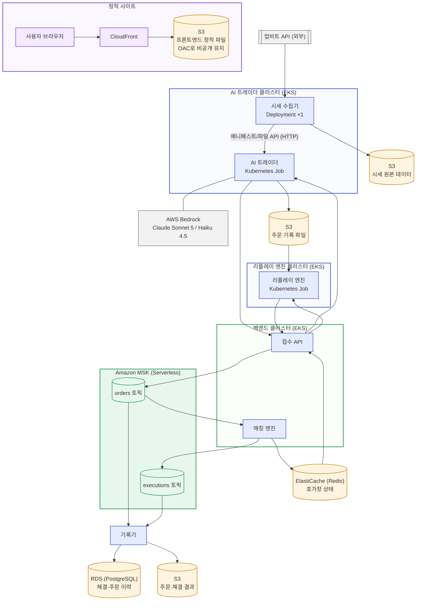

# Truss 시스템 아키텍처

## 변경 이력
| 날짜 | 변경 내용 |
|---|---|
| 2026-08-05 | 시세 수집기→AI 트레이더 구간의 Kafka 시세 토픽을 제거하고 HTTP 매니페스트/파일 API(풀 방식)로 정정 — 이 경로는 애초에 Kafka를 안 쓰기로 확정돼 있었는데 2026-08-03 다이어그램 최초 작성 시 반대로 반영됨. MSK는 orders/executions 토픽만 남김. requirements.md와 함께 정정 |
| 2026-08-03 | requirements.md·ai-trader-design.md 및 팀 논의를 종합해 전체 시스템 아키텍처 다이어그램 최초 작성. 담당자 표기(A/B/C) 제거·화살표 정리, AI 트레이더·리플레이 엔진·백엔드를 별도 EKS 클러스터(총 3개)로 분리. 시세 수집기·MSK·모니터링 스택(AMP+Grafana, CloudWatch Logs) 배치 확정, 프론트엔드에 CloudFront(OAC) 추가로 S3 비공개 전환. 다이어그램은 여러 차례 방향·레이아웃 조정 끝에 TB로 최종화 |

## 관련 문서
- [요구사항 정의서](requirements.md) — 전체 요구사항과 인프라 구성의 근거
- [AI 트레이더 설계 문서](ai-trader-design.md) — 부하생성 클러스터 내 AI 트레이더 상세 설계
- 리플레이 엔진 설계 문서 — 작성 예정
- [API 명세서](api-specification.md), [ERD](erd.md)

---

## 1. 전체 아키텍처 다이어그램

모니터링 스택(Amazon Managed Prometheus + Grafana, CloudWatch Logs)은 세 클러스터·MSK 전체에서 지표·로그를 받는 횡단 관심사라 화살표로 표시하면 다른 선과 겹치므로 다이어그램에는 넣지 않았다 — 상세는 2장 표 참고.

**범례**: 파랑 = 컴퓨트(EKS), 주황 = 저장소(S3/RDS/Redis), 초록 = 메시징(MSK), 보라 = 정적 사이트 진입점(CloudFront), 회색 = 외부 시스템. 세 EKS 클러스터(AI 트레이더/리플레이 엔진/백엔드)는 물리적으로 분리되어 있다 — 리플레이 엔진(부하 생성 주체)과 매칭 엔진(측정 대상)이 자원을 공유하면 성능 측정값이 왜곡되며, AI 트레이더 세션이 리플레이 성능 시험과 동시에 돌아도 같은 문제가 생기기 때문에 셋을 모두 나눴다. Kafka를 Amazon MSK(관리형)로 둔 것도 같은 이유다 — 세 클러스터 어디에도 속하지 않는 별도 리소스라 브로커가 매칭 엔진의 자원을 나눠 쓰지 않는다. 시세 수집기는 업비트 접속 수 제한("단일 인스턴스" 원칙)을 지키기 위해 Job이 아니라 Deployment(replicas=1, `strategy: Recreate`)로 둬서 세션이 여러 개 겹쳐도 인스턴스가 늘어나지 않게 한다.

---

## 2. AWS 리소스와 역할

| 리소스 | 구성 요소 | 역할 |
|---|---|---|
| CloudFront + S3 | 프론트엔드 | CloudFront가 CDN 캐싱과 HTTPS를 담당하고, S3는 OAC(Origin Access Control)로 비공개 유지한 채 오리진으로만 쓴다 — S3 버킷을 퍼블릭으로 열어두지 않아도 된다 |
| S3 | 시세 원본 데이터 | 업비트에서 수집한 원본 시세(OHLCV, 개별 체결) 보관 |
| S3 | 주문 기록 파일 | AI 트레이더가 페이퍼 트레이딩 중 제출한 주문의 시간순 기록 — 리플레이 엔진의 입력 |
| S3 | 주문·체결 결과 | 페이퍼 트레이딩 체결 결과 등 원본 보관 |
| EKS (AI 트레이더 클러스터) | AI 트레이더 | 트레이딩 세션 단위로 실행되는 Kubernetes Job |
| EKS (리플레이 엔진 클러스터) | 리플레이 엔진 | 리플레이 세션 단위로 실행되는 Kubernetes Job. 성능 측정의 부하 생성 주체라 다른 워크로드와 자원을 공유하지 않도록 별도 클러스터로 둔다 |
| EKS (백엔드 클러스터) | 접수 API, 매칭 엔진 | 상시 서비스 — 주문 접수·검증·매칭. 성능 측정 대상이라 다른 클러스터와 분리한다 |
| EKS (AI 트레이더 클러스터) | 시세 수집기 | 업비트 접속 수 제한으로 단일 인스턴스만 운영해야 한다. Job이 아니라 Deployment(replicas=1, `strategy: Recreate`)로 둬서, 트레이딩 세션이 여러 개 겹쳐도 인스턴스가 늘어나지 않게 한다 |
| RDS (PostgreSQL) | DB | 페이퍼 트레이딩/리플레이 이력, 체결 결과 |
| ElastiCache (Redis) | 캐시 | 호가창 현재 상태, 리플레이 중 발생하는 주문 결과 |
| AWS Bedrock | LLM 호출 | AI 트레이더의 모멘텀 추종·평균회귀 봇이 Claude를 호출해 방향 신호 생성 |
| Amazon MSK (Serverless) | orders/executions 토픽 | 컴포넌트 간 비동기 메시징 — 마켓명 기준 파티션으로 순서 보장. 세 EKS 클러스터 밖의 관리형 서비스라 매칭 엔진의 측정 자원을 갉아먹지 않는다. IAM 인증으로 IRSA 패턴을 그대로 재사용. 시세 수집기→AI 트레이더 구간은 Kafka를 쓰지 않는다(과거 데이터·요청당 소비자 1개뿐이라 pub-sub 이점이 없음) — 3장 참고 |
| Amazon Managed Prometheus (AMP) | 지표 저장소 | 세 EKS 클러스터가 각각 지표를 remote_write로 하나의 AMP 워크스페이스에 모은다 — 클러스터는 분리했지만 지표는 한곳에서 본다 |
| Amazon Managed Grafana (AMG) | 대시보드 | AMP(앱·K8s 지표)와 CloudWatch(MSK 지표, 로그)를 모두 데이터소스로 연결해 하나의 화면·시간축에서 확인한다(NFR-17) |
| CloudWatch Logs | 로그 수집 | 각 클러스터의 Fluent Bit이 로그를 전송해 중앙 집계한다(FR-21) |

---

## 3. 데이터 흐름

**시세 처리**
1. 사용자가 트레이딩 기간을 선택하면, 시세 수집기가 업비트에서 해당 기간의 20개 마켓 시세를 수신해 원본을 S3에 저장한다
2. AI 트레이더가 시세 수집기(백엔드)의 매니페스트 API를 HTTP로 호출해 마켓별 batch/stream 파일 URL을 받고, 각 파일을 요청해 받아온다(최초 일괄[batch] + 실시간 순차[stream]) — **결정**: 시세는 이미 기간이 정해진 과거 데이터이고 요청당 소비자가 하나뿐이라 Kafka의 pub-sub 이점이 크지 않아, 이 구간에는 Kafka를 쓰지 않고 HTTP 풀(pull) 방식을 쓴다

**주문 처리 (페이퍼 트레이딩)**
4. AI 트레이더의 판단 로직(봇 5종)이 시세와 호가창을 참고해 방향 신호를 만든다 — 이 중 2종은 AWS Bedrock의 Claude를 호출한다
5. 주문 생성 로직이 방향 신호를 실제 주문으로 변환해 접수 API에 실시간 제출하고, 동시에 파일로 기록한다
6. 접수 API는 검증 후 Kafka orders 토픽에 발행한다
7. 매칭 엔진이 주문을 소비해 체결을 수행하고, 호가창 상태를 Redis에 반영한다(접수 API가 이 값을 조회 응답으로 돌려준다)
8. 체결 결과는 Kafka executions 토픽을 거쳐 기록기가 RDS·S3에 저장한다 — 기록기는 주문 자체(측·가격·수량·상태)를 채우기 위해 orders 토픽도 함께 구독한다
9. 트레이딩 세션 종료 시 AI 트레이더의 주문 기록 파일이 S3에 최종 업로드된다

**주문 처리 (리플레이)**
10. 리플레이 엔진이 S3의 주문 기록 파일을 지정 배속으로 읽어, 판단 로직 재실행 없이 그대로 접수 API에 재제출한다
11. 이후 흐름(6~8)은 페이퍼 트레이딩과 동일하며, DB에는 리플레이 이력으로 구분해 저장된다

**모니터링**: 부하생성 클러스터와 백엔드 클러스터 양쪽 모두 지표·로그를 모니터링 스택으로 보내 단일 대시보드에서 확인한다(FR-21, FR-25).

---

## 4. 남은 검토 사항

인프라 리소스 종류는 모두 확정했다. 남은 건 세부 설정값이다.

- CloudFront 캐시 정책, ACM 인증서(커스텀 도메인 사용 여부)
- AMP/AMG 워크스페이스를 세 클러스터가 공유할지, 클러스터별로 둘지
- FR-21의 "주문 단위 구간별 소요 시간 추적"은 분산 트레이싱이 필요한 영역이라 AMP/Grafana만으로는 부족할 수 있다 — AWS X-Ray 또는 Jaeger 도입 여부는 별도 결정 필요([API 명세서](api-specification.md) 7장 참고)
