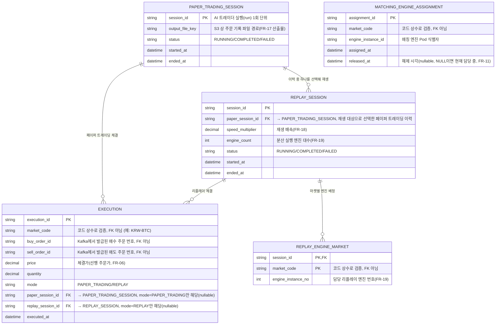

# ERD (Entity Relationship Diagram)

## 변경 이력
| 날짜 | 변경 내용 |
|---|---|
| 2026-08-05 | TRADE_ORDER(주문) 테이블 제거 — FR-18에 따라 주문은 Redis에만 반영되고 RDS는 체결 결과만 저장. EXECUTION을 중심 테이블로 재구성하고 PAPER_TRADING_SESSION 신설(AI 트레이더 실행 회차 구분, 리플레이 대상 선택). MARKET·TRADER_BOT은 코드 상수로 관리하기로 하여 테이블에서 제외 |
| 2026-07-31 | requirements.md(1장·2장) 기준으로 ERD 최초 작성 |

## 1. 설계 범위

이 ERD는 [requirements.md](requirements.md) 1.2.1 데이터 흐름에서 **DB(RDS/PostgreSQL)** 저장 대상으로 명시된 데이터만을 다룬다.

> "기록기가 체결 결과를 DB(RDS/PostgreSQL)에 저장한다. 저장 대상은 페이퍼 트레이딩 이력, 리플레이 이력, 리플레이시 발생하는 체결 결과로 구분해 관리한다" (1.2.1)
>
> "이 과정에서 발생하는 주문 결과는 Redis에, 체결 결과는 DB에 저장한다" (FR-18)

**핵심 전제**: 주문(접수~미체결 상태)은 RDS에 저장하지 않는다. Kafka(이벤트 로그)와 Redis(호가창 캐시)에서만 관리되고, RDS에는 **체결 결과(EXECUTION)만** 비동기로 적재된다. 접수 API가 매 요청마다 RDS에 동기 쓰기를 한다면 NFR-01(초당 1만 건 접수)·NFR-04(접수 응답 p99 100ms)를 satisfy할 수 없다는 점도 같은 결론을 뒷받침한다.

### 범위 제외 (다른 저장소로 관리)
| 데이터 | 저장소 | 제외 사유 |
|---|---|---|
| 주문(접수·취소·미체결 잔량 등 주문 자체) | Kafka + Redis(ElastiCache) | RDS 저장 대상 아님(FR-18) — 호가창은 인메모리로만 유지(1.2.2, NFR-03), 멱등성 체크(FR-02)도 Redis에서 처리 |
| 호가창(미체결 주문) 현재 상태 | Redis(ElastiCache) | 인메모리로만 유지, 디스크 미기록(1.2.2, NFR-03) |
| 업비트 시세 원본(초/분/일/주/월/년 OHLCV, 개별 체결) | S3 | 시계열 원본 데이터, 관계형 모델 대상 아님(1.2.1, FR-14) |
| 페이퍼 트레이딩 주문 기록 파일 | S3 | 리플레이 입력 파일(FR-17). `PAPER_TRADING_SESSION.output_file_key`로 경로만 참조 |
| 마켓 마스터(20개 종목), 트레이더 봇 유형(5종) | 애플리케이션 코드 상수 | 고정 카디널리티, 체결 정합성과 무관, DB 조회 요구사항 없음 — Kafka 메시지 라벨로만 흘러 모니터링 스택(FR-21)에서 집계 |
| TPS·컨슈머 랙·응답시간 등 운영 지표, 로그 | 모니터링 스택(Prometheus 등) | 시계열 지표, RDS 대상 아님(FR-21, NFR-16) |

이 ERD가 다루는 것은 **체결·페이퍼 트레이딩 실행 이력·리플레이 실행·엔진 배정**이며, 근거 요구사항은 FR-06·FR-09(체결), FR-13(거래 내역 조회), FR-11(마켓 재분배), FR-16\~19(트레이더 봇·주문 기록·리플레이·분산 실행)이다.

## 2. ER 다이어그램

> `MATCHING_ENGINE_ASSIGNMENT`는 다른 엔티티와 관계가 없는 고립된 테이블이다. 5절 "확인이 더 필요한 부분" 참고.

## 3. 엔티티 설명

### PAPER_TRADING_SESSION
AI 트레이더 실행(run) 1회 단위(FR-16). 같은 시스템으로 여러 번 실행하면 각각 독립된 페이퍼 트레이딩 이력이 생기고, 리플레이(FR-18)는 그 중 하나를 선택해 재생하므로 이 실행 회차를 구분할 엔티티가 필요하다.

### EXECUTION
매칭 엔진이 체결한 결과(FR-06, FR-09). RDS에 저장되는 유일한 거래 데이터다. 매수·매도 주문 번호는 Kafka에서 발급된 값을 문자열로만 보관하며(주문 자체가 RDS에 없으므로 FK가 아니다), FR-09 검증("체결 결과의 매수·매도 주문 번호가 실제 체결 주문과 일치")은 이 값을 Kafka/Redis 상의 주문과 대조해 수행한다. 거래 내역 조회(FR-13)는 이 테이블을 최신순으로 조회한다.

### REPLAY_SESSION
리플레이 1회 실행 단위(FR-18). 어떤 `PAPER_TRADING_SESSION`을 재생 대상으로 선택했는지, 배속, 분산 실행 시 사용한 엔진 대수를 기록해 재현 가능성을 확보한다.

### REPLAY_ENGINE_MARKET
리플레이 분산 실행 시(FR-19) 세션 내에서 마켓을 어떤 리플레이 엔진 인스턴스가 담당했는지 기록한다.

### MATCHING_ENGINE_ASSIGNMENT
매칭 엔진 수 증감에 따른 마켓 재분배 이력(FR-11). "한 마켓은 항상 정확히 한 엔진만 담당"(1.2.2) 원칙을 `released_at IS NULL` 조건으로 검증할 수 있다. — 다만 RDS 테이블로 둘지는 재검토 필요(5절).

## 4. 설계 근거 메모

- **주문(TRADE_ORDER) 테이블 없음**: FR-18이 "리플레이 중 발생하는 주문 결과는 Redis에, 체결 결과는 DB에 저장한다"고 명시한다. 접수 시점마다 RDS에 동기 쓰기를 하면 NFR-01(초당 1만 건)·NFR-04(p99 100ms)를 달성할 수 없다는 점도 같은 결론을 가리킨다. 주문은 Kafka(FR-08 복구용 이벤트 로그) + Redis(현재 호가창)에서만 관리하고, 멱등성 체크(FR-02, `client_request_id`)도 자연스럽게 Redis 쪽 책임이 된다.
- **PAPER_TRADING_SESSION 신설**: AI 트레이더를 여러 번 실행하면 각각 독립된 페이퍼 트레이딩 이력이 생기고, 리플레이는 그중 하나를 선택해 재생한다. 세션 단위 구분이 없으면 여러 실행의 체결 결과가 뒤섞여 FR-18 검증("동일 파일 재생 시 총 주문 수·마켓별 비율 동일")을 할 수 없다.
- **EXECUTION.mode 컬럼(테이블 분리 대신)**: 페이퍼 트레이딩/리플레이 체결 이력을 별도 테이블로 나누는 대신 `mode` 컬럼 + `paper_session_id`/`replay_session_id` 중 하나만 채우는 방식으로 구분했다. 두 모드가 동일한 컬럼 구조를 쓰고 서로 비교 조회하는 일이 잦아(FR-18 검증), 테이블을 나누면 매번 UNION이 필요해진다.
- **market_code / bot_type을 컬럼값으로만 사용**: 20개 마켓, 5종 봇 모두 고정된 낮은 카디널리티 값이고 체결 정합성과 무관하며, DB에서 조회·집계해야 한다는 요구사항이 없다(모니터링 대시보드는 Kafka 라벨 기반 지표로 처리). 따라서 MARKET·TRADER_BOT 테이블을 두지 않고 애플리케이션 코드 상수로 관리한다.
- **가격/수량 정밀도**: `price`, `quantity`는 암호화폐 특성상 소수점 자리수가 커 부동소수점 오차가 정합성 요구사항(NFR-07\~10)에 영향을 줄 수 있으므로 DECIMAL(NUMERIC) 타입을 전제로 했다.

## 5. 확인이 더 필요한 부분

- **MATCHING_ENGINE_ASSIGNMENT, REPLAY_ENGINE_MARKET을 RDS에 둘 필요가 있는가?** 두 테이블 모두 "마켓을 어떤 엔진이 담당하는가"라는 운영/코디네이션 상태다. `MATCHING_ENGINE_ASSIGNMENT`는 Kafka 파티션 키가 이미 마켓명이므로(1.2.2) Kafka 컨슈머 그룹의 파티션 재배정 자체가 "한 마켓은 한 엔진만 담당"을 보장해줄 수 있어, RDS에 별도로 기록할 필요가 없을 수 있다. `REPLAY_ENGINE_MARKET`도 정적 설정(엔진별 담당 마켓을 배포 시 고정)으로 처리 가능하면 마찬가지다. 두 요구사항(FR-11, FR-19) 모두 검증 기준이 지표(CPU 사용률·전송량)이지 DB 조회가 아니라서, 굳이 RDS에 저장해야 할 근거가 약하다. 팀 논의 필요.
