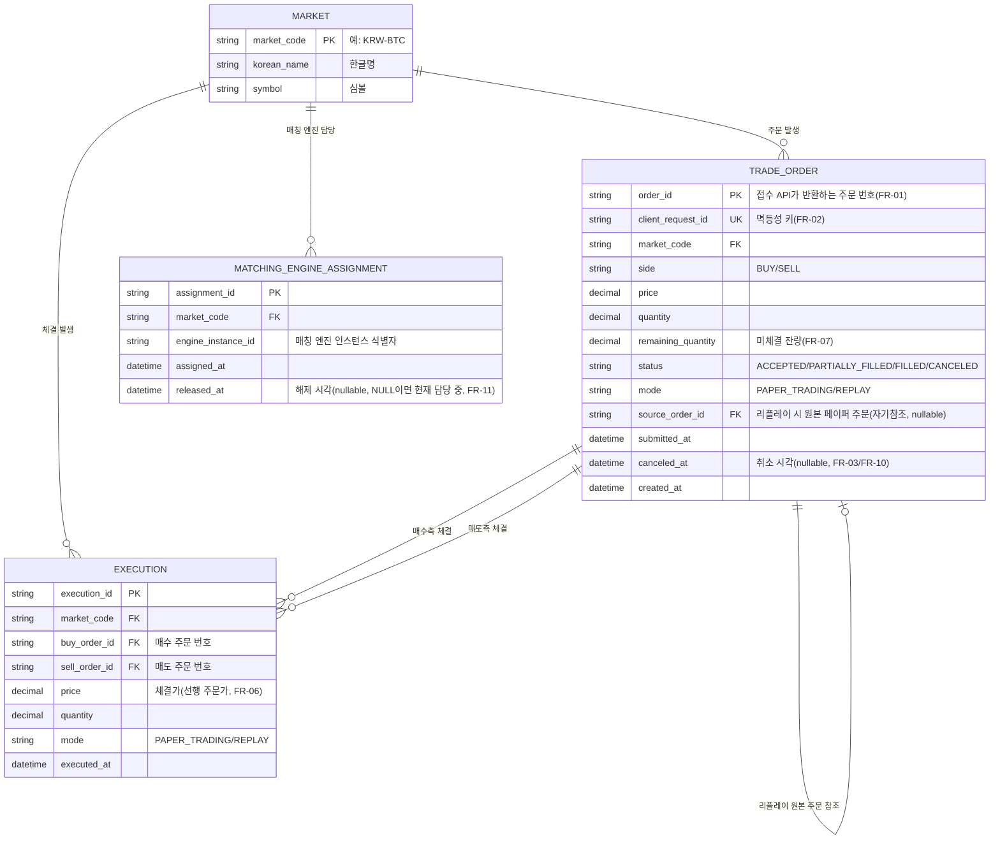

# ERD (Entity Relationship Diagram)

## 변경 이력
| 날짜 | 변경 내용 |
|---|---|
| 2026-08-07(5차) | FR-19 세션 가드 충돌을 `runId` 그룹 모델로 구현·검증 완료 — `orderapi/session`의 `Claim`이 `owner, runID` 두 값을 받아 같은 `runId`의 여러 멤버를 한 그룹으로 묶고, Redis Set으로 그룹 멤버를 추적해 마지막 멤버 반납 시에만 그룹을 해제한다. 라이브 검증 중 세션 ID 구분자로 쓴 `"#"`이 URL 프래그먼트로 해석되는 버그를 발견해 `"."`로 수정. §5의 마지막 남은 항목이 해결돼 §5에 남은 항목 없음 |
| 2026-08-07(4차) | FR-19 세션 가드 충돌 항목에 팀 결정 반영: 인스턴스 2대부터 시작해 점진적으로 늘리는 스케일 테스트 방식 채택, `matching`의 FR-11 같은 동적 재분배 로직은 만들지 않기로 확정(`replayengine`은 1회성 배치 Job이라 필요 없음). 세션 가드 자체를 어떻게 고칠지는 여전히 다음 작업으로 남음(§5) |
| 2026-08-07(3차) | **`TRADE_ORDER.source_order_id` 배관 완성** — `trader`가 `orderapi` 응답의 `orderId`를 파싱해 FR-17 기록 파일(`RecordedOrder.OrderID`)에 남기고, `replayengine`이 리플레이 제출 시 그 값을 `POST /v1/orders`의 새 선택 필드 `sourceOrderId`(`docs/api-specification.md` §2.1)로 실어 보내며, `orderapi`가 이를 Kafka NEW 이벤트에 태워 기록기가 `trade_order.source_order_id`(FK 없음, `execution.buy_order_id`/`sell_order_id`와 같은 이유)로 저장한다. `OrderSubmitter.Submit`이 이제 `(orderID string, err error)`를 반환하도록 시그니처가 바뀌었다(`trader/order`) |
| 2026-08-07(2차) | **`REPLAY_SESSION` 테이블·`TRADE_ORDER.replay_session_id` 컬럼 제거로 결론** — TPS/컨슈머 랙 같은 운영 지표를 이미 RDS 대신 모니터링 스택으로 뺀 전례(1장 "범위 제외" 표)에 비춰, "이 리플레이가 어떤 파일/배속/엔진 대수로 돌았는지"도 프로세스 로그·K8s Job 스펙만으로 충분하다고 판단해 굳이 테이블을 만들지 않기로 함(4장 참고). **`source_order_id`는 `REPLAY_SESSION`과 무관하게 독립적으로 남김** — 세션 개념 없이도 `TRADE_ORDER` 자기참조만으로 채울 수 있고, FR-18 검증("동일 파일 재생 시 총 주문 수 일치")에 필요해서 구현은 계속 예정(5장). 문서화 과정에서 **별도의 실제 구현 공백을 새로 발견**: FR-19(리플레이 엔진 분산 실행)는 여러 `replayengine` 프로세스를 동시에 띄우는 걸 전제하는데, "동시 실행 방지" 세션 가드(`orderapi/session`)가 `owner`와 무관하게 시스템 전체에서 단 하나의 세션만 허용하는 구조라 두 번째 샤드의 `Claim`이 무조건 409로 거부됨 — 팀 논의 필요, 5장에 남김 |
| 2026-08-07(1차) | 기록기 DB를 PostgreSQL에서 **MySQL**로 전환(팀 결정, 기본 포트 3306) — 스키마 자체(테이블/컬럼 구조)는 바뀌지 않았고 `recorder/schema.sql`의 타입 표현만 MySQL 문법에 맞춘 것(예: `TEXT`→`VARCHAR(N)`, `NUMERIC`→`DECIMAL(24,8)`, `TIMESTAMPTZ`→`DATETIME(3)`). `MATCHING_ENGINE_ASSIGNMENT`를 실제로 채우는 배관을 완성: `matching`이 `Acquire`/`Release` 시점에 새 Kafka 토픽 `assignments`로 `ASSIGNED`/`RELEASED` 이벤트를 발행하고, 기록기가 이를 구독해 이 테이블에 기록한다(팀 결정: "기록기가 모든 DB 입력을 담당"). 이 과정에서 크래시(강제 종료) 시 이전 배정 행이 영원히 `released_at IS NULL`로 남는 문제를 발견해, 새 `ASSIGNED` 기록 시 같은 마켓의 기존 열린 행을 먼저 닫도록 수정(4장 참고) |
| 2026-08-06(3차) | "기록기"(`recorder/` 신규 Go 모듈) 구축: `orders`/`executions` 토픽을 소비해 `TRADE_ORDER`/`EXECUTION`을 채움. `X-Order-Mode` 헤더 배관으로 `mode` 컬럼을 채울 수 있게 됨(`docs/api-specification.md` §1.3), `remaining_quantity`는 기록기가 체결 트랜잭션에서 직접 계산. §5의 `mode`/`remaining_quantity`/`EXECUTION.mode` 항목을 §4로 이동(해결됨) — `REPLAY_SESSION` 관련만 §5에 남음 |
| 2026-08-06(2차) | 스키마 정리: `TRADER_BOT`/`REPLAY_ENGINE_MARKET` 제거, `MARKET.frequency_group` 제거, `TRADE_ORDER.status` 값을 실제 코드(`orderapi/order/order.go`)와 일치시킴(`OPEN`→`ACCEPTED`, `CANCELLED`→`CANCELED`). `TRADE_ORDER.client_request_id`는 `orderapi`가 Kafka `orders` 토픽 메시지에 `clientRequestId` 필드로 실어 보내도록 코드를 바꿔 채울 수 있게 함(`orderapi/kafkaclient/kafkaclient.go`). `MATCHING_ENGINE_ASSIGNMENT`는 FR-11이 실제로 구현·검증됐으므로 "빈 테이블" 메모를 갱신. `REPLAY_SESSION` 관련 세션 격리 문제는 결론 없이 계속 검토 중으로 남김 |
| 2026-08-06(1차) | `orderapi`/`matching`/`trader`/`replayengine` 실제 구현과 대조해 "지금 채울 방법이 없는" 테이블/컬럼을 5장에 정리(스키마 변경 아님, 발견 사항만 기록) |
| 2026-07-31 | requirements.md(1장·2장) 기준으로 ERD 최초 작성 |

## 1. 설계 범위

이 ERD는 [requirements.md](requirements.md) 1.2.1 데이터 흐름에서 **DB(RDS/PostgreSQL)** 저장 대상으로 명시된 데이터만을 다룬다.

> "기록기가 체결 결과를 DB(RDS/PostgreSQL)에 저장한다. 저장 대상은 페이퍼 트레이딩 이력, 리플레이 이력, 리플레이시 발생하는 체결 결과로 구분해 관리한다" (1.2.1)

### 범위 제외 (다른 저장소로 관리)
| 데이터 | 저장소 | 제외 사유 |
|---|---|---|
| 호가창(미체결 주문) 현재 상태 | Redis(ElastiCache) | 인메모리로만 유지, 디스크 미기록(1.2.2, NFR-03) |
| 리플레이시 발생하는 주문 결과(실시간 조회용) | Redis(ElastiCache) | 조회 API·트레이더·리플레이 엔진이 즉시 읽는 캐시 용도(1.2.1-5) |
| 업비트 시세 원본(초/분/일/주/월/년 OHLCV, 개별 체결) | S3 | 시계열 원본 데이터, 관계형 모델 대상 아님(1.2.1, FR-14) |
| 페이퍼 트레이딩 주문 기록 파일 | S3 | 리플레이 입력 파일(FR-17), 파일 형태로 저장 |
| TPS·컨슈머 랙·응답시간 등 운영 지표, 로그 | 모니터링 스택(Prometheus 등) | 시계열 지표, RDS 대상 아님(FR-21, NFR-16) |

이 ERD가 다루는 것은 **주문·체결·리플레이 실행·엔진 배정**이며, 근거 요구사항은 FR-01\~04(주문), FR-05\~11(매칭·재분배), FR-13(거래 내역 조회), FR-17\~19(주문 기록·리플레이·분산 실행)이다. (트레이더 봇(FR-16)은 봇별 DB 테이블이 아니라 로그/모니터링 스택으로 다루기로 했다 — 4장 참고.)

## 2. ER 다이어그램

## 3. 엔티티 설명

### MARKET
업비트 원화 마켓 20개 종목의 마스터 데이터(1.1.4). 신규 상장·상장폐지가 없는 고정 목록이므로 값이 자주 바뀌지 않는다. `TRADE_ORDER`/`EXECUTION`/`MATCHING_ENGINE_ASSIGNMENT`의 `market_code` FK가 존재하지 않는 마켓 코드를 참조하지 못하게 막는 참조 무결성 목적이 크다.

### TRADE_ORDER
접수 API가 처리하는 모든 주문. `mode`로 페이퍼 트레이딩/리플레이를 구분하고(FR-09), 리플레이 주문은 `source_order_id`로 원본 페이퍼 트레이딩 주문을 참조해 "동일 파일 재생 시 총 주문 수·마켓별 비율 동일"(FR-18 검증)을 추적할 수 있게 한다. `client_request_id`는 중복 주문 방지(FR-02) 판별 키다. `status` 값은 `docs/api-specification.md`가 정의하고 `orderapi/order/order.go`가 실제로 쓰는 상수(`ACCEPTED`/`PARTIALLY_FILLED`/`FILLED`/`CANCELED`)와 정확히 일치시켰다 — 이전 초안의 `OPEN`/`CANCELLED`는 실제 코드에 없는 값이었다.

### EXECUTION
매칭 엔진이 체결한 결과(FR-06, FR-09). 매수·매도 주문 번호를 각각 참조해 "체결 결과의 매수·매도 주문 번호가 실제 체결 주문과 일치"(FR-09 검증)를 보장한다. 거래 내역 조회(FR-13)는 이 테이블을 최신순으로 조회한다.

### MATCHING_ENGINE_ASSIGNMENT
매칭 엔진 수 증감에 따른 마켓 재분배 이력(FR-11). "한 마켓은 항상 정확히 한 엔진만 담당"(1.2.2) 원칙을 `released_at IS NULL` 조건으로 검증할 수 있다. FR-11은 실제로 구현·검증됐고(`matching/main.go`의 `marketRegistry.Acquire`/`Release`), **2026-08-07부터 실제로 이 테이블에 값이 채워진다**: `matching`이 `Acquire`/`Release` 시점마다 Kafka `assignments` 토픽에 `ASSIGNED`/`RELEASED` 이벤트를 발행하고(`matching/kafkaclient/assignment_producer.go`), 기록기가 그걸 구독해 행을 기록한다(`recorder/store/mysql.go`의 `AssignMarket`/`ReleaseMarket`) — `matching`은 여전히 RDS에 직접 쓰지 않는다(role B는 Kafka 경유만, 팀 결정: "기록기가 모든 DB 입력을 담당"). `REPLAY_ENGINE_MARKET`(제거됨, 4장 참고)과 달리 이 배정은 측정된 부하에 따라 동적으로 정해지므로 사후에 재계산할 수 없어서, 기록해둘 실질적인 가치가 있다.

## 4. 설계 근거 메모

- **order/execution 분리**: 부분 체결(FR-07)이 존재하므로 주문 1건에 체결이 여러 건 붙을 수 있어 1:N으로 분리했다.
- **mode 컬럼(테이블 분리 대신)**: 페이퍼 트레이딩/리플레이 이력을 별도 테이블로 나누는 대신 `mode` 컬럼으로 구분했다. 두 모드 모두 동일한 컬럼 구조(마켓·가격·수량·상태)를 쓰고, FR-18 검증("동일 파일 재생 시 총 주문 수·마켓별 비율 동일")처럼 두 모드를 서로 비교하는 조회가 잦기 때문에 테이블을 나누면 비교 쿼리마다 UNION이 필요해진다.
- **자기참조 source_order_id**: 리플레이는 "판단 로직 재실행 없이 그대로 재생"(1.1.2 용어 정의)하므로 리플레이 주문은 항상 페이퍼 트레이딩 원본 주문 하나에 대응한다. 이 관계를 표현하기 위해 TRADE_ORDER가 자기 자신을 참조한다.
- **가격/수량 정밀도**: `price`, `quantity`는 암호화폐 특성상 소수점 자리수가 커 부동소수점 오차가 정합성 요구사항(NFR-07\~10)에 영향을 줄 수 있으므로 DECIMAL(NUMERIC) 타입을 전제로 했다.
- **제거된 테이블/컬럼(2026-08-06)**:
  - **`TRADER_BOT`, `TRADE_ORDER.bot_id`** — 채울 배관(주문에 "어떤 봇이 만들었는지" 실어 보낼 필드)이 없는 것과 별개로, 이 정보의 용도(FR-25 "봇별 주문 현황")가 애초에 RDS로 정규화할 성격이 아니라고 판단했다. 1장의 "범위 제외" 표가 TPS·컨슈머 랙 같은 운영 지표를 이미 모니터링 스택으로 뺀 것과 같은 이유 — 봇별 집계도 로그/모니터링 쪽에서 다루는 게 일관된다.
  - **`REPLAY_ENGINE_MARKET`** — FR-19의 마켓 분산은 `replayengine`이 `i % shardCount == shardIndex`로 완전히 결정론적으로 계산한다(`CLAUDE.md`의 `replayengine/main.go` 설명 참고) — 중앙에서 내려주는 실제 배정 이벤트가 없고, `-shard-count`(엔진 대수)와 마켓 목록만 알면 언제든 재계산 가능해서 별도로 기록할 정보가 없다. `MATCHING_ENGINE_ASSIGNMENT`는 반대로 런타임에 측정된 부하로 동적으로 정해지는 배정(FR-11, LPT)이라 사후 재계산이 불가능하므로 남겨뒀다.
  - **`MARKET.frequency_group`** — `requirements.md` 1.1.4의 종목 선정 근거 설명에만 쓰이고 실제 코드 어디에도 이 분류가 없어, 이 값을 실제로 참조하는 로직이 생기기 전까지는 순수 문서용 메타데이터를 컬럼으로 둘 이유가 약하다고 판단했다.
  - **`REPLAY_SESSION`, `TRADE_ORDER.replay_session_id`(2026-08-07 팀 결정)** — 리플레이 1회 실행이 어떤 파일/배속/엔진 대수로 돌았는지를 RDS에 영구히 남기는 게 원래 목적이었지만, 이 정보도 `TRADER_BOT`/`REPLAY_ENGINE_MARKET`/`MARKET.frequency_group`을 뺀 것과 같은 이유로 정규화된 테이블이 꼭 필요하진 않다고 판단했다 — 이미 프로세스 로그에 남고, K8s Job으로 실행한다면 Job 스펙에도 그대로 보존된다(`CLAUDE.md`의 "Trader/simulator launch via K8s Job" 절 참고). 이 프로젝트가 ~1개월짜리 인프라 부하테스트이고 리플레이를 반복해서 아주 여러 번 돌릴 계획이 아니라, EXECUTION 행을 실행별로 SQL JOIN으로 구조적으로 비교해야 할 필요가 지금은 낮다고 봤다. 트레이드오프: 나중에 여러 리플레이 실행 결과를 자주 비교해야 하는 상황이 오면, 시각 범위로 대략 추정하는 것보다 불편해질 수 있다 — 그때 다시 필요성을 재검토한다. **`source_order_id`는 이 결정과 무관하게 독립적으로 남았다** — 세션 개념 없이도 `TRADE_ORDER` 자기참조만으로 채울 수 있는 별개의 컬럼이라, 제거하지 않고 5장에서 계속 구현을 추진한다.
- **`TRADE_ORDER.status` 값 수정** — 이전 초안의 `OPEN`/`CANCELLED`는 실제로 구현된 `docs/api-specification.md`/`orderapi/order/order.go`의 상수(`ACCEPTED`/`CANCELED`)와 다른 값이었다. ERD를 실제 API 계약에 맞춰 고쳤다(`cancelled_at`→`canceled_at`도 같은 이유).
- **`TRADE_ORDER.client_request_id` 배관 추가** — 이전엔 `orderapi`의 Kafka `orders` 토픽 메시지에 `Idempotency-Key` 값이 실려 있지 않아 이 컬럼을 채울 방법이 없었다. `orderapi/kafkaclient/kafkaclient.go`의 `orderEvent`에 `clientRequestId` 필드를 추가하고, `Publisher.PublishNew`가 그 값을 받아 싣도록 고쳤다(`server.go`의 `acceptOrderHandler`가 이미 갖고 있던 `Idempotency-Key` 값을 그대로 전달) — `order.Order`(HTTP 응답 바디로도 나가는 구조체)에는 담지 않아 `docs/api-specification.md`의 응답 계약은 그대로다. 이제 "기록기"가 `orders` 토픽에서 이 값을 읽어 채울 수 있다.
- **`TRADE_ORDER.mode`/`EXECUTION.mode` 배관 추가(2026-08-06)** — `POST /v1/orders`에 새 헤더 `X-Order-Mode`(`docs/api-specification.md` §1.3)를 추가해 `orderapi`가 페이퍼 트레이딩/리플레이 주문을 구분할 수 있게 했다. `orderEvent`에 `mode`(NEW만)/`canceledAt`(CANCEL만) 필드도 같은 방식으로 추가해, `trader`는 항상 `PAPER_TRADING`을, `replayengine`은 항상 `REPLAY`를 명시적으로 보낸다. `EXECUTION.mode`는 매수·매도 양쪽 `TRADE_ORDER.mode`가 다를 경우(세션 가드 덕분에 극히 드문, 이전 세션이 남긴 미체결 주문이 새 세션과 매칭되는 경우로 예상) 매수측 값을 쓰고 경고 로그를 남긴다(`recorder/store/apply.go`의 `ResolveMode`) — 비정규화 자체는 의도한 설계로 확정.
- **`TRADE_ORDER.remaining_quantity` 배관 추가(2026-08-06)** — 매칭 엔진이 별도로 발행하지 않고, "기록기"가 체결 반영 트랜잭션 안에서 `remaining_quantity = remaining_quantity - 체결수량`으로 스스로 계산한다(`recorder/store/mysql.go`의 `updateFill` — MySQL은 `UPDATE ... RETURNING`이 없어 `UPDATE`로 잠금+계산+쓰기를 하고 같은 트랜잭션에서 별도 `SELECT`로 `mode`를 읽는다; 그 행의 잠금이 커밋까지 유지되므로 여러 체결이 동시에 들어와도 갱신 레이스가 없다).
- **FR-19(리플레이 엔진 분산 실행) 세션 가드 충돌 — 구현·검증 완료(2026-08-07)**. `orderapi/session`의 배타성 단위를 "프로세스 1개"에서 "`runId`로 묶인 그룹 1개"로 확장해 해결했다: `Claim(ctx, owner, runID)`가 `runID`를 비워 보내면(예: `trader`, 애초에 안 나뉨) 서버가 하나 생성해 예전과 동일한 "멤버 1개짜리 그룹"으로 동작하고, `replayengine` 샤드들이 새 `-run-id` 플래그로 똑같은 값을 보내면 전부 한 그룹에 합류한다(다른 `runId`/owner는 지금처럼 409). Redis에 `orderapi:session:members:{runID}` Set을 추가해 "그룹에 지금 몇 명이 있는지" 추적하고, 반납 시 이 Set에서 제거한 뒤 **마지막 멤버였을 때만** 그룹 키를 즉시 지운다(멤버가 남아있으면 그룹은 살아있음) — 크래시로 반납을 못 한 멤버는 Set에 유령으로 남지만, TTL 자체는 그룹 전체가 여전히 자연 소멸하므로 정합성엔 문제없다(다만 그 경우 "마지막 반납 시 즉시 해제" 최적화가 한 번 안 먹고 TTL을 기다림 — 감내 가능하다고 판단). **라이브 검증 중 발견한 버그**: 첫 구현은 합성 세션 ID 구분자로 `"#"`을 썼는데, 클라이언트가 URL을 문자열 이어붙이기로만 만들다 보니(URL 인코딩 없음) `#`이 URL 프래그먼트로 해석돼 `curl`/`net/http`가 그 뒤(`/heartbeat` 등)를 통째로 잘라버려 엉뚱한 404/405가 났다 — 구분자를 `"."`로 바꿔 해결. 실제 Redis(`infra/dev-redis`)로 검증: 샤드 2개가 같은 `runId`로 합류 성공, 다른 `runId`는 그룹이 살아있는 동안 계속 409, 마지막 아닌 멤버의 반납은 그룹을 안 건드림, 마지막 멤버 반납 시에만 그룹 키 전부 삭제, 그 직후 새 `runId`가 바로 클레임 성공 — 전부 확인됨.
- **`MATCHING_ENGINE_ASSIGNMENT`의 크래시 자가치유(2026-08-07)** — 매칭 엔진 인스턴스가 정상 종료 없이 강제로 죽으면 `RELEASED` 이벤트를 보낼 기회가 없어, 그 인스턴스가 담당했던 마켓의 이전 행이 영원히 `released_at IS NULL`로 남는다 — "이 조건으로 지금 담당자를 알 수 있다"는 이 테이블의 존재 목적 자체가 깨지는 실제 버그였다(라이브 검증 중 발견). `AssignMarket`이 새 배정을 기록하기 전에 같은 `market_code`의 기존 열린 행을 먼저 닫도록 고쳐 해결했다 — Kafka 컨슈머 그룹의 `Generation.Start` 계약(새 배정을 받았다는 건 이전 담당자가 이미 완전히 멈췄다는 뜻)이 이 전제를 보장해주기 때문에 안전하다.
- **`TRADE_ORDER.source_order_id` 배관 완성(2026-08-07)** — 2단계로 나눠 구현했다. **(1)** `trader/order/http_submitter.go`가 `orderapi` 응답의 `orderId`를 파싱하도록 고치고, `OrderSubmitter.Submit`이 그 값을 반환하도록 시그니처를 바꿔(`RecordingSubmitter`가 성공한 제출에서만 orderId를 얻을 수 있어야 하므로), `RecordedOrder`에 새 `OrderID` 필드를 추가해 FR-17 기록 파일에 실제로 남긴다. **(2)** `replayengine`이 그 값을 읽어 `POST /v1/orders` 요청 바디에 `sourceOrderId`(선택 필드, `docs/api-specification.md` §2.1)로 실어 보내고, `orderapi`가 `clientRequestId`/`mode`와 같은 패턴으로 이를 Kafka NEW 이벤트에 태워, 기록기가 `trade_order.source_order_id`로 저장한다(`recorder/store/mysql.go`). trader의 신규(페이퍼 트레이딩) 주문은 이 필드가 항상 빈 문자열이라, 요청 바디에도 아예 실리지 않는다(`omitempty`). **FK를 걸지 않은 이유**는 `execution.buy_order_id`/`sell_order_id`와 같다 — 원본 주문과 리플레이 주문은 서로 다른 실행(몇 시간~며칠 간격)에서 발생할 수 있어, 기록기가 원본 주문의 NEW 이벤트를 아직 처리하지 못한 상태로 리플레이 주문의 NEW 이벤트가 먼저 도착할 수 있다 — FK였다면 `INSERT IGNORE`가 이런 경우 행 전체를 조용히 건너뛴다(스키마 주석 참고).

## 5. 남은 검토 사항 (실제 구현과 대조해 발견, 스키마는 아직 안 바꿈)

`orderapi`(role A)·`matching`(role B)·`trader`·`replayengine`·`recorder`를 실제로 구현·검증해보니, 이 ERD가 전제하는 정보 중 일부가 **지금의 API 계약/코드로는 채울 방법이 없다.** 테이블/컬럼 자체가 잘못됐다기보다, 그 값을 만들어 넘겨주는 배관이 시스템 어디에도 아직 없다는 뜻이다 — 그래서 "삭제"가 아니라 "지금 당장은 못 채우는 것"으로 정리해둔다. (2026-08-06 논의로 `TRADER_BOT`/`REPLAY_ENGINE_MARKET`/`MARKET.frequency_group`/`MATCHING_ENGINE_ASSIGNMENT`/`client_request_id`/`mode`/`remaining_quantity` 항목은 결론이 나서 4장으로 옮겼고, 2026-08-07 `REPLAY_SESSION`/`replay_session_id`도 "만들지 않기로", `source_order_id`도 "구현 완료"로, FR-19 세션 가드 충돌도 "구현·검증 완료"로 결론이 나서 4장으로 옮겼다 — 현재 이 장에 남은 항목은 없다.)
