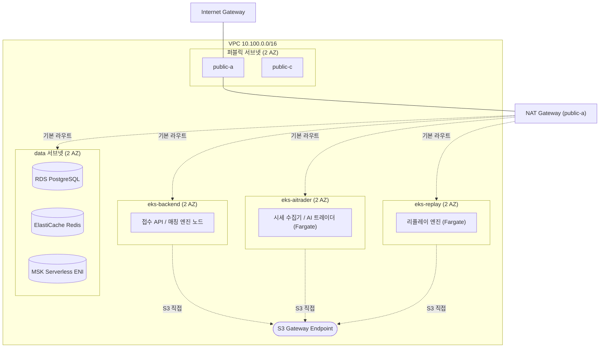

# 인프라 배치 설계 (AWS 리소스 배치)

## 변경 이력
| 날짜 | 변경 내용 |
|---|---|
| 2026-08-05 | 시세 수집기→AI 트레이더 구간의 Kafka(시세 토픽) 의존을 제거 — `sa-collector`/`sa-ai-trader` IRSA의 MSK 권한, `sg-eks-aitrader`→`sg-msk` 보안 그룹 행, MSK 토픽 목록의 `market-data` 삭제(2.2절, 3장, 8장). architecture.md·requirements.md와 함께 정정 |
| 2026-08-04 | requirements.md·architecture.md·ai-trader-design.md·api-specification.md·erd.md·회의록 및 기존 Terraform(`infra/`)을 근거로 네트워크·컴퓨트·보안 배치 설계 최초 작성 |

## 관련 문서
- [요구사항 정의서](requirements.md) — 인프라 구성 표(1.2.3), 성능·정합성·가용성 요구사항(1.4)
- [시스템 아키텍처](architecture.md) — 리소스 목록·데이터 흐름(이미 확정). 본 문서는 "무엇을 쓸지"가 아니라 "어디에 어떻게 배치할지"만 다룬다
- [AI 트레이더 설계 문서](ai-trader-design.md) — EKS Job 구조, Bedrock 연동
- [API 명세서](api-specification.md), [ERD](erd.md)
- `infra/` (Terraform, 이미 적용됨) — VPC·S3 버킷·IAM 역할 일부가 이미 존재

---

## 0. 설계 전제

- **계정/리전**: 여러 팀이 공유하는 AWS 계정(`727646470302`), 리전은 `ap-northeast-2`(서울) 고정. 모든 리소스는 `team1-*`로 네임스페이스한다(기존 `infra/` 관례 유지)
- **일정**: 4주 프로젝트. 상시 가동 비용이 큰 리소스(EKS 컨트롤 플레인 3개, NAT 게이트웨이 등)는 가용성보다 **비용·구축 단순성**을 우선한다. 이중화가 필요한 지점은 근거를 명시하고, 그 외에는 단일 AZ/단일 인스턴스로 시작한다
- **기존 상태 반영**: `infra/network.tf`에 VPC(`10.100.0.0/16`)와 퍼블릭 서브넷 1개(`ap-northeast-2a`)가 이미 있고, `infra/s3.tf`에 `team1-truss-market-data` 버킷이 이미 있다. 본 설계는 이를 확장하는 형태로 제시한다(기존 리소스 재설계 아님)
- **범위**: architecture.md 2장의 리소스 목록(EKS 3클러스터, MSK, RDS, ElastiCache, S3, Bedrock, CloudFront, AMP/AMG, CloudWatch Logs)은 그대로 채택한다. 여기서는 서브넷 배치, 보안 그룹, 노드 구성, IRSA 매핑 등 **배치 세부사항**을 정한다

---

## 1. 네트워크 설계

### 1.1 서브넷 구성

기존 VPC(`10.100.0.0/16`)를 유지하고, AZ를 2개(`ap-northeast-2a`, `ap-northeast-2c`)로 확장한다. 매칭 엔진(측정 대상)·MSK·RDS·Redis는 프라이빗 서브넷에 두고, 인터넷 노출이 필요한 것은 CloudFront/ALB 앞단뿐이다.

| 서브넷 | CIDR | AZ | 유형 | 용도 |
|---|---|---|---|---|
| `public-a` | 10.100.1.0/24 | 2a | 퍼블릭 | (기존, 유지) NAT GW, 향후 ALB |
| `public-c` | 10.100.2.0/24 | 2c | 퍼블릭 | ALB 이중화용 예비 |
| `eks-backend-a` | 10.100.11.0/24 | 2a | 프라이빗 | 백엔드 클러스터 노드(접수 API·매칭 엔진) |
| `eks-backend-c` | 10.100.12.0/24 | 2c | 프라이빗 | 〃 |
| `eks-aitrader-a` | 10.100.21.0/24 | 2a | 프라이빗 | AI 트레이더 클러스터(시세 수집기·트레이더 Job) |
| `eks-aitrader-c` | 10.100.22.0/24 | 2c | 프라이빗 | 〃 |
| `eks-replay-a` | 10.100.31.0/24 | 2a | 프라이빗 | 리플레이 엔진 클러스터 |
| `eks-replay-c` | 10.100.32.0/24 | 2c | 프라이빗 | 〃 |
| `data-a` | 10.100.41.0/24 | 2a | 프라이빗 | RDS, ElastiCache, MSK ENI |
| `data-c` | 10.100.42.0/24 | 2c | 프라이빗 | 〃 |

세 EKS 클러스터를 물리적으로 분리하는 목적(측정 격리, architecture.md 참고)은 **클러스터·노드 자체를 분리**하면 달성되며, VPC까지 나눌 필요는 없다. 하나의 VPC 안에서 서브넷만 클러스터별로 분리하면 MSK·RDS·Redis를 세 클러스터가 공유 접근하는 구성이 단순해진다(피어링·전송 게이트웨이 불필요).

### 1.2 NAT / 인터넷 아웃바운드

- NAT 게이트웨이는 **`public-a`에 1개만** 둔다. 모든 프라이빗 서브넷의 기본 라우트를 이 NAT로 보낸다.
  - 근거: NAT 게이트웨이를 AZ마다 두면 이중화는 되지만 시간당 비용이 2배가 된다. 이 프로젝트는 부하 시험 중 AZ 장애를 검증 대상으로 삼지 않으므로(NFR-11/12는 서버 1대·Kafka 1대 장애를 다루지, AZ 장애를 명시하지 않음) 단일 NAT로 시작하고, 실제 병목이 확인되면 추가한다
- **S3 Gateway Endpoint**(무료)를 VPC에 추가한다. 시세 수집기·기록기·AI 트레이더·리플레이 엔진 모두 S3 트래픽이 크므로, NAT를 거치지 않고 S3로 직접 나가게 해 NAT 비용과 대역폭 병목을 동시에 줄인다
- ECR(이미지 pull)·CloudWatch Logs·STS용 Interface Endpoint는 **1차 구축에서는 생략**하고 NAT 경유로 시작한다. 배포 빈도가 높아 NAT 비용/지연이 실제로 문제가 되면 추가 검토(4장 "남은 결정 사항" 참고)

### 1.3 네트워크 다이어그램

---

## 2. EKS 클러스터 3개 배치

architecture.md에서 이미 "3개 클러스터로 분리"는 확정했다. 여기서는 각 클러스터를 **어떤 컴퓨트 방식으로, 어떤 서브넷에, 어떤 크기로** 둘지 정한다.

| 클러스터 | 워크로드 | 컴퓨트 방식 | 서브넷 | 근거 |
|---|---|---|---|---|
| 백엔드 클러스터 | 접수 API(Deployment), 매칭 엔진(Deployment, 마켓당 1 Pod) | **EC2 관리형 노드그룹** | `eks-backend-a/c` | 성능 측정 대상(NFR-01~04)이라 Fargate보다 예측 가능한 CPU·네트워크 성능이 필요. 인스턴스 타입은 컴퓨트 최적화 계열(`c6i.xlarge` 등)로 시작해 부하 시험 결과로 조정 |
| AI 트레이더 클러스터 | 시세 수집기(Deployment ×1), AI 트레이더(Kubernetes Job) | **Fargate** | `eks-aitrader-a/c` | 세션 단위로 뜨고 사라지는 워크로드라 상시 노드를 띄워둘 이유가 없다. Job이 없을 때 유휴 EC2 비용이 0이 된다 |
| 리플레이 엔진 클러스터 | 리플레이 엔진(Kubernetes Job, 분산 실행 시 최대 4대) | **Fargate** | `eks-replay-a/c` | 위와 동일 이유. FR-19 검증(CPU 사용률 80% 이하)은 Fargate 태스크의 vCPU 할당량 대비 사용률로도 측정 가능 |

**시세 수집기는 Fargate에서도 Deployment(`replicas: 1`, `strategy: Recreate`)로 유지**해 업비트 접속 수 제한(단일 인스턴스 원칙, architecture.md)을 그대로 지킨다.

### 2.1 백엔드 클러스터 노드그룹

- 관리형 노드그룹(EC2), 최소 2 / 기본 3 / 최대 8~10대(20개 마켓 매칭 엔진 Pod + 접수 API Pod가 함께 뜨는 것을 감안한 시작값, 부하 시험 결과로 조정)
- Cluster Autoscaler로 노드 수를 조정하고, Pod 수는 KEDA가 Kafka 컨슈머 랙 기준으로 조정한다(FR-20, NFR-14: 랙 초과 후 120초 내 증설)
- 한 마켓은 매칭 엔진 1대만 담당(1.2.2 설계 원칙) — Pod Anti-Affinity로 같은 마켓 담당 Pod가 중복 스케줄되지 않게 한다(마켓 재분배 로직은 애플리케이션 레벨(FR-11)에서 처리하되, 인프라는 이를 방해하지 않게 배치만 보장)

### 2.2 IRSA 매핑

| 서비스 어카운트 | 클러스터 | 부여 권한 | 접근 대상 |
|---|---|---|---|
| `sa-ingest-api` | 백엔드 | MSK 발행(orders) | MSK |
| `sa-matching-engine` | 백엔드 | MSK 구독/발행(orders, executions) | MSK |
| `sa-recorder` | 백엔드 | RDS 접속, S3 PutObject | RDS, `team1-truss-trade-results` |
| `sa-collector` | AI 트레이더 | S3 PutObject | `team1-truss-market-data` |
| `sa-ai-trader` | AI 트레이더 | S3 PutObject(주문 기록), **Bedrock InvokeModel**(모멘텀·평균회귀 봇만) | `team1-truss-order-records`, Bedrock |
| `sa-replay-engine` | 리플레이 | S3 GetObject(주문 기록 파일 읽기) | `team1-truss-order-records` |

Bedrock 호출 권한은 **AI 트레이더 클러스터의 서비스 어카운트에만** 부여한다(백엔드·리플레이 클러스터는 Bedrock을 호출하지 않으므로 아예 권한을 주지 않음 — NFR-18 최소 권한 원칙).

---

## 3. 메시징 — MSK Serverless

- ENI를 `data-a`/`data-c` 서브넷에 배치(2 AZ)
- 인증은 IAM 인증(SASL/IAM)만 사용 — EKS IRSA 자격 증명을 그대로 재사용하므로 별도 자격 증명 관리가 필요 없다(architecture.md에 명시된 방식)
- 토픽: `orders`, `executions` — 파티션 키는 마켓명(NFR-07). 시세는 이 MSK를 거치지 않는다 — 시세 수집기→AI 트레이더는 HTTP 매니페스트/파일 API(풀 방식)를 쓴다(과거 데이터·소비자 1개뿐이라 Kafka pub-sub 이점이 없음, architecture.md 3장 참고)
- 보안 그룹(`sg-msk`)은 아래 3장 참고

---

## 4. 데이터 계층

### 4.1 RDS (PostgreSQL)

- `data-a`(기본) / `data-c`(대기 서브넷, Multi-AZ 전환 대비)에 서브넷 그룹 구성
- **1차는 Single-AZ**로 시작한다. NFR-12("서버 1대 또는 Kafka 1대 장애 시 유실 없음")가 명시하는 장애 시나리오는 컴퓨트 노드와 MSK 브로커이며 RDS 자체 장애 주입은 요구사항에 없다. Multi-AZ는 비용이 약 2배이므로, 부하 시험 계획에 RDS 장애 시나리오가 추가되면 그때 전환한다(전환은 인스턴스 재시작 없이 가능)
- 인스턴스 클래스는 `db.t3.medium` 또는 `db.m6g.large`로 시작 — 체결 기록은 쓰기 위주(FR-09)이므로 gp3 스토리지에 IOPS를 필요 시 별도 프로비저닝
- 자동 백업 활성화(스냅샷), `deletion_protection`은 프로젝트 종료 시 정리 편의를 위해 초기엔 비활성화하고 데모데이 직전에만 켜는 것을 권장

### 4.2 ElastiCache (Redis)

- `data-a`/`data-c`에 서브넷 그룹 구성, **Multi-AZ 자동 장애 조치(replication group, primary+replica 1개)**를 켠다
  - 근거: 호가창 상태 조회는 접수 API 응답 경로(NFR-04, p95 50ms)에 직접 걸리는 데다, NFR-11(매칭 엔진 재시작 후 60초 내 처리 재개)에도 영향을 준다. RDS와 달리 Redis 단일 노드 장애는 곧바로 조회 API 전체를 막으므로 이중화 우선순위가 더 높다
- 노드 타입은 `cache.t4g.small`~`cache.r6g.large`로 시작, 클러스터 모드는 비활성화(단일 샤드) — 20개 마켓의 호가창 상태는 데이터량이 크지 않아 샤딩까지는 불필요

---

## 5. 스토리지 — S3 버킷

기존 `team1-truss-market-data`(시세 원본)에 3개 버킷을 추가한다. 용도별로 버킷을 분리해 IAM 정책을 IRSA 서비스 어카운트별로 좁게 스코프한다(현재 `iam.tf`의 EC2 인스턴스 프로필 방식은 EKS IRSA 역할로 대체·확장한다).

| 버킷 | 용도 | 쓰기 주체 | 읽기 주체 |
|---|---|---|---|
| `team1-truss-market-data` (기존) | 시세 원본(OHLCV, 개별 체결) | 시세 수집기 | AI 트레이더(직접 아님, 시세 수집기의 매니페스트/파일 API를 HTTP로 호출해 받음), 분석용 |
| `team1-truss-order-records` (신규) | 페이퍼 트레이딩 주문 기록 파일 | AI 트레이더 | 리플레이 엔진 |
| `team1-truss-trade-results` (신규) | 주문·체결 결과 원본 | 기록기 | (조회용, 필요 시) |
| `team1-truss-frontend` (신규) | 프론트엔드 정적 파일 | CI/CD 파이프라인 | CloudFront(OAC 경유만) |

기존 결정(CLAUDE.md, `s3.tf`) 그대로 유지: **라이프사이클 규칙 없음**(같은 시뮬레이션 데이터로 인프라 변경 전후 성능을 비교해야 하므로), SSE-S3 암호화, 퍼블릭 액세스 전면 차단, `prevent_destroy = true`.

---

## 6. 프론트엔드 엣지 — CloudFront + S3

- `team1-truss-frontend` 버킷은 OAC(Origin Access Control)로 비공개 유지, CloudFront만 오리진으로 접근 가능
- ACM 인증서: 커스텀 도메인을 쓸 경우 CloudFront는 리전 무관하게 **`us-east-1`에 발급된 인증서만** 사용 가능 — 도메인 사용 여부가 정해지면 `us-east-1`에 별도 provider alias 필요(현재 `providers.tf`는 `ap-northeast-2` 고정이므로 추가 provider 블록 필요)
- 캐시 정책은 정적 자산(JS/CSS/이미지)만 장기 캐시, `index.html`은 캐시 미적용(배포 직후 반영 지연 방지)

---

## 7. LLM — AWS Bedrock

- **리전 확인 필요**: ai-trader-design.md의 예시 코드는 `us-east-1`을 쓰고 있는데, 나머지 인프라는 전부 `ap-northeast-2`다. Claude Sonnet 5 / Haiku 4.5가 서울 리전에서 온디맨드로 제공되지 않으면 **크로스 리전 추론 프로파일**(예: APAC 또는 US 프로파일)을 써야 한다 — 이 경우 IRSA 정책의 리소스 ARN을 실제 호출 리전에 맞춰 지정해야 하므로, 착수 전에 Bedrock 콘솔에서 모델 가용 리전을 먼저 확인해야 한다(8장 "남은 결정 사항")
- IRSA 정책은 `bedrock:InvokeModel`을 **특정 모델 ARN으로 제한**하고(계정 내 다른 Bedrock 모델 호출 차단), AI 트레이더 클러스터의 `sa-ai-trader`에만 부여한다(2.2절)
- VPC 안에서 Bedrock을 호출하려면 기본적으로 NAT를 경유한다. Interface Endpoint(`com.amazonaws.<region>.bedrock-runtime`)는 호출 빈도가 낮으면(봇 판단 주기가 수 초 단위) 굳이 필요 없고, 실제 호출량이 늘어나면 추가 검토

---

## 8. 보안 그룹 매트릭스

| 소스 | 대상 | 포트 | 용도 |
|---|---|---|---|
| `sg-eks-backend` | `sg-msk` | 9098 (IAM) | 접수 API 발행, 매칭 엔진 구독/발행 |
| `sg-eks-replay` | `sg-msk` | 9098 (IAM) | (리플레이는 Kafka 직접 접근 없음 — 접수 API만 호출. 표기는 배제 가능) |
| `sg-eks-backend` | `sg-rds` | 5432 | 기록기 → RDS 저장 |
| `sg-eks-backend` | `sg-redis` | 6379 | 매칭 엔진 쓰기, 접수 API 읽기 |
| `sg-eks-aitrader` | `sg-eks-backend` (ALB/ClusterIP) | 443 | AI 트레이더 → 접수 API 호출 |
| `sg-eks-replay` | `sg-eks-backend` (ALB/ClusterIP) | 443 | 리플레이 엔진 → 접수 API 호출 |
| `public-a/c` (CloudFront) | `S3 (frontend)` | 443 | OAC 경유 정적 파일 서빙 |

원칙: **RDS·Redis는 백엔드 클러스터에서만** 접근 가능(architecture.md 정합성 점검에서 AI 트레이더는 Redis를 직접 읽지 않고 접수 API의 GET 응답으로 호가창을 받는 구조로 확정됐으므로, `sg-redis`에 AI 트레이더/리플레이 클러스터를 열어줄 필요가 없다). **MSK도 백엔드 클러스터에서만** 접근한다(접수 API 발행, 매칭 엔진 구독/발행) — 시세 수집기·AI 트레이더·리플레이 엔진은 Kafka를 직접 쓰지 않는다. 시세 수집기→AI 트레이더는 HTTP 매니페스트/파일 API(풀 방식, 3장 참고), AI 트레이더·리플레이 엔진→접수 API는 위 두 행처럼 HTTP 호출이다.

---

## 9. 모니터링 배치

- **AMP(Amazon Managed Prometheus)**: 워크스페이스 1개를 3개 클러스터가 공유한다(architecture.md 4장의 미결 사항에 대한 제안). 클러스터는 분리했지만 지표는 한 곳에서 봐야 NFR-17(단일 화면·동일 시간축)을 만족하며, 클러스터별로 워크스페이스를 나누면 AMG에서 여러 데이터소스를 조합해야 해 오히려 복잡해진다
- **AMG(Amazon Managed Grafana)**: 워크스페이스 1개, 데이터소스로 AMP(앱·K8s 지표)와 CloudWatch(MSK 지표, 로그)를 함께 연결
- **로그 수집**: 백엔드 클러스터(EC2 노드)는 Fluent Bit DaemonSet으로 CloudWatch Logs 전송. AI 트레이더/리플레이 클러스터는 Fargate이므로 DaemonSet을 쓸 수 없어 **Fargate 로그 라우터**(Fargate profile의 `logConfiguration`)로 CloudWatch에 직접 전송한다
- **분산 트레이싱**: FR-21의 "주문 단위 구간별 소요 시간 추적"은 AMP/Grafana만으로는 부족할 수 있다(architecture.md에서 미결). AWS X-Ray를 백엔드 클러스터에 X-Ray 데몬 사이드카/DaemonSet으로 추가하는 안을 검토 대상으로 남긴다(8장)

---

## 10. 단계별 구축 순서 제안

기존 `infra/`(bootstrap, network, s3, iam)는 이미 적용돼 있으므로, 아래는 그 이후 순서다.

1. 네트워크 확장: `network.tf`에 AZ 2c 서브넷, 프라이빗 서브넷 8개, NAT GW, S3 Gateway Endpoint 추가
2. 백엔드 EKS 클러스터 + 관리형 노드그룹 (가장 먼저 — A/B 팀이 병렬 개발 중인 접수 API·매칭 엔진의 배포 대상)
3. MSK Serverless (백엔드가 Kafka에 의존하므로 클러스터 직후)
4. RDS, ElastiCache
5. AI 트레이더 EKS 클러스터(Fargate) + Bedrock IRSA
6. 리플레이 엔진 EKS 클러스터(Fargate)
7. S3 추가 버킷 3개
8. CloudFront + 프론트엔드 버킷
9. AMP/AMG, CloudWatch Logs, Fluent Bit
10. CI/CD(GitHub Actions → ECR → EKS 배포, 환경 분리는 네임스페이스 또는 클러스터 단위로 FR-24에 맞춰 구성)

---

## 11. 남은 결정 사항

- Bedrock에서 Claude Sonnet 5 / Haiku 4.5가 `ap-northeast-2`에서 직접 호출 가능한지, 크로스 리전 추론 프로파일이 필요한지 확인 필요 — 확인 후 IRSA 정책·클라이언트 리전 설정 확정
- RDS Multi-AZ 전환 여부: 부하 시험 계획에 DB 장애 주입 시나리오가 추가되는지에 따라 결정
- ECR/CloudWatch/STS Interface Endpoint 추가 여부: NAT 비용·지연이 실측으로 문제가 될 때 재검토
- CloudFront 커스텀 도메인 사용 여부(사용 시 `us-east-1` ACM 인증서·추가 Terraform provider 필요)
- 커스텀 도메인 미사용 시 CloudFront 기본 도메인(`*.cloudfront.net`)으로 데모데이 진행 가능 여부
- X-Ray 도입 여부(FR-21 구간별 소요 시간 추적)와 도입 시 배치 위치(백엔드 클러스터 사이드카 vs DaemonSet)
- 매칭 엔진 노드그룹의 정확한 인스턴스 타입·min/max는 1차 부하 시험 결과로 확정(현재 값은 시작점)
