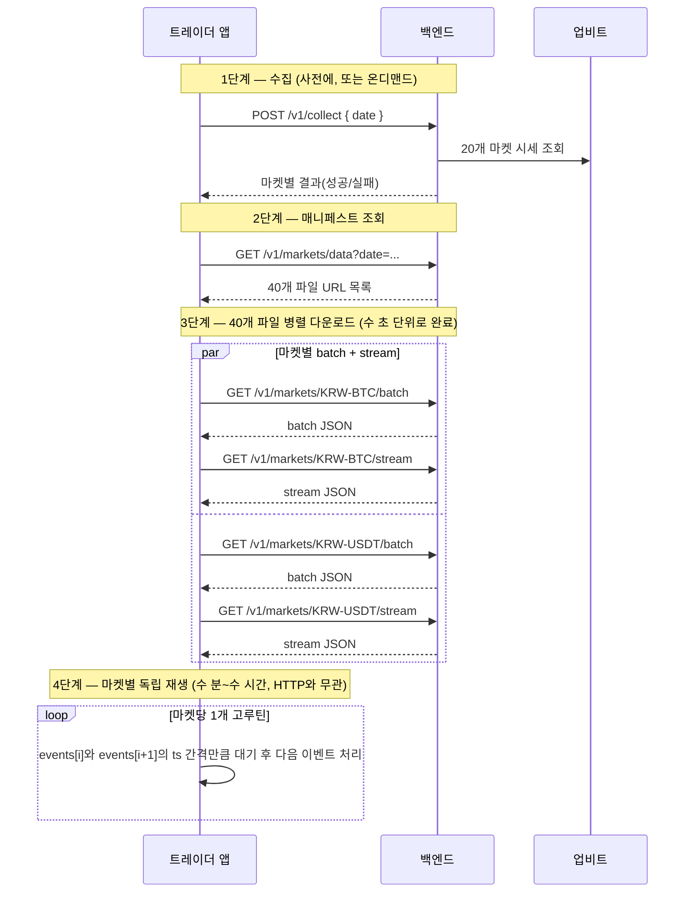

# 시세 데이터 수집·전달 API 명세서

## 변경 이력
| 날짜 | 변경 내용 |
|---|---|
| 2026-08-04 | `date` 파라미터의 하루 경계를 UTC → **KST**로 변경(팀 결정). 아래 예시의 `range` 표기도 KST(`+09:00`)로 갱신 |
| 2026-08-04 | 트레이더 측 재생 엔진 기본형(`trader/`, 별도 Go 모듈) 구현 완료 — 매니페스트 조회부터 마켓별 페이싱 재생까지. 주문 생성/AI 판단 로직은 다음 단계 |
| 2026-08-04 | 개별 파일 GET API(`GET /v1/markets/{market}/{kind}`) 구현 완료 — 온디맨드 수집(`singleflight` 기반 마켓+날짜 단위 중복 방지) 포함. 트레이더 전달 API 3종 전부 구현 완료 |
| 2026-08-03 | 매니페스트 API(`GET /v1/markets/data`) 구현 완료. 온디맨드 수집 트리거 책임 소재를 결정(개별 파일 GET이 담당, 매니페스트는 존재 확인 안 함) — "미해결 사항" 절 해소 |
| 2026-08-03 | 수집 트리거 API(`POST /v1/collect`, 구현 완료)와 트레이더 전달 API(매니페스트+개별 파일 GET, 설계 확정·미구현) 최초 작성 |

## 관련 문서
- 이 문서가 다루는 데이터 포맷의 근거는 [CLAUDE.md](../CLAUDE.md)의 "Output JSON file format" 절이다 (배치/스트림 JSON 필드 매핑 전체는 그쪽이 원본).
- 주문 접수·매칭 쪽 API는 별도 문서 [api-specification.md](api-specification.md)에서 관리한다. 이 문서는 [requirements.md](requirements.md) FR-14(시세 수집), FR-16(트레이더 봇 데이터 전달 분류)에 대응한다.

---

## 1. 개요

시세 데이터는 **수집(백엔드 ← 업비트)**과 **전달(트레이더 ← 백엔드)**이 서로 다른 API로 분리되어 있다.

| API | 방향 | 상태 |
|---|---|---|
| `POST /v1/collect` | 관리자/운영 → 백엔드 → 업비트 | **구현 완료** |
| `GET /v1/markets/data` (매니페스트) | 트레이더 → 백엔드 | **구현 완료** |
| `GET /v1/markets/{market}/{kind}` (개별 파일) | 트레이더 → 백엔드 | **구현 완료** |

대상 마켓은 항상 [requirements.md 1.1.4](requirements.md)의 20개 전체이며, 개별 마켓 단위 요청은 지원하지 않는다 — 날짜 하나로 20개 마켓 전체가 한 번에 처리된다.

**`date=YYYY-MM-DD`는 KST(한국 표준시, UTC+9) 기준 하루다.** 업비트가 한국 거래소라 UTC보다 KST가 더 자연스럽다는 팀 판단. `2026-07-27`을 요청하면 `2026-07-27T00:00:00+09:00` ~ `2026-07-28T00:00:00+09:00` 구간이 수집·서빙된다.

---

## 2. 수집 트리거 API (구현됨)

### `POST /v1/collect`

지정한 날짜의 UTC 00:00~다음날 00:00 구간을 20개 마켓 전체에 대해 업비트에서 수집해 batch/stream JSON으로 저장한다. 구현: [backend/server.go](../backend/server.go), [backend/collector.go](../backend/collector.go).

**Request**
```json
{ "date": "2026-07-27" }
```

**Response 200 OK**
```json
{
  "date": "2026-07-27",
  "range": { "start": "2026-07-27T00:00:00+09:00", "end": "2026-07-28T00:00:00+09:00" },
  "results": [
    { "market": "KRW-BTC", "status": "ok", "batchPath": "...", "streamPath": "..." },
    { "market": "KRW-USDT", "status": "error", "error": "업비트 체결 내역은 최근 7일 이내만 조회할 수 있습니다 (daysAgo=12)" }
  ]
}
```

**Response 400 Bad Request** — `date` 누락 또는 `YYYY-MM-DD` 형식이 아님
```json
{ "error": "date는 YYYY-MM-DD 형식이어야 합니다" }
```

| 항목 | 동작 |
|---|---|
| 응답 방식 | **동기** — 20개 마켓 수집이 전부 끝난 뒤 응답 (마켓당 수 초~수십 초, 전체 수 분 소요될 수 있음) |
| 마켓별 실패 | 요청 전체를 실패시키지 않고 `results[].status: "error"`로 개별 표시 (예: 7일 초과 날짜 요청 시 체결 내역 조회만 실패) |
| 멱등성 | 저장소가 prod(S3)일 때 `HeadObject` 확인 후 이미 있으면 재생성하지 않음 (`dataset.s3Storage`) |

---

## 3. 트레이더 전달 API

### 설계 결정: 매니페스트 + 개별 파일 프록시

40개(20개 마켓 × batch/stream) 파일을 한 응답에 전부 담지 않는다 — stream 파일 하나가 실측 기준 수 MB(체결이 많은 마켓은 더 큼)라, 20개를 한 JSON에 합치면 응답이 과도하게 커진다. 대신:

1. **매니페스트 API**로 "어떤 URL에서 어떤 파일을 받을 수 있는지" 목록만 먼저 전달
2. 트레이더가 그 목록을 보고 **40개 파일을 개별 GET으로, 병렬로** 받아감

파일 내용은 **S3 presigned URL이 아니라 백엔드가 직접 프록시**한다 — 트레이더가 S3 자격증명을 전혀 몰라도 되고(CLAUDE.md의 "트레이더는 백엔드 API로만 접근" 원칙과 일치), presigned URL의 만료 시간 관리도 필요 없어진다.

### `GET /v1/markets/data?date=2026-07-27` (매니페스트, 구현됨)

**Response 200 OK**
```json
{
  "date": "2026-07-27",
  "markets": [
    {
      "market": "KRW-BTC",
      "batchUrl": "/v1/markets/KRW-BTC/batch?date=2026-07-27",
      "streamUrl": "/v1/markets/KRW-BTC/stream?date=2026-07-27"
    }
    // ... 20개 마켓 전체
  ]
}
```

**Response 400 Bad Request** — `date` 누락 또는 `YYYY-MM-DD` 형식이 아님

구현: [backend/server.go](../backend/server.go)의 `manifestHandler`. **파일 존재 여부는 확인하지 않는다** — `dataset.Storage`를 전혀 건드리지 않고, `upbit.TargetMarkets` 20개에 대해 URL 문자열만 기계적으로 생성해 반환한다 (아래 "온디맨드 수집 책임 소재" 참고).

### `GET /v1/markets/{market}/{kind}?date=2026-07-27` (개별 파일, 구현됨)

`{kind}`는 `batch` 또는 `stream`. 응답 바디는 [CLAUDE.md](../CLAUDE.md)에 정의된 batch/stream JSON 파일 내용 그대로 — 저장된 파일을 백엔드가 읽어서(dev: 로컬 디스크, prod: S3 `GetObject`) 그대로 흘려보낸다.

**Response 400 Bad Request** — `kind`가 `batch`/`stream`이 아니거나 `date` 형식 오류
**Response 404 Not Found** — `{market}`이 대상 20개 마켓에 없음
**Response 500 Internal Server Error** — 온디맨드 수집 실패(예: 7일 초과 날짜) 또는 파일 읽기 실패

구현: [backend/server.go](../backend/server.go)의 `fileHandler`.

### 온디맨드 수집 책임 소재 (결정 및 구현 완료)

하이브리드 생성 설계(CLAUDE.md 참고: 사전 생성 + 온디맨드 생성 모두 지원)에 따라, 요청받은 날짜의 파일이 아직 없을 수 있다. **누가 수집을 트리거하느냐**를 다음과 같이 정하고 그대로 구현했다:

- **매니페스트는 트리거하지 않는다.** 존재 확인 자체를 안 하므로(위 참고) 항상 빠르게 응답한다.
- **개별 파일 GET(`/v1/markets/{market}/{kind}`)이 트리거한다.** `fileHandler`가 `dataset.Storage.LoadBatch`/`LoadStream`을 먼저 시도하고, `dataset.ErrNotFound`를 받으면 그 자리에서 해당 마켓만 `collectMarket`으로 수집한 뒤 다시 읽어서 서빙한다.

**중복 수집 방지**: `collectMarket`은 batch와 stream을 한 번의 호출로 같이 만든다. 트레이더가 같은 마켓의 batch/stream을 거의 동시에 요청하면(매니페스트 받은 직후 병렬 다운로드 시작 — 4절 참고), 두 요청이 동시에 "파일 없음"을 볼 수 있다. `backend/collector.go`의 `ensureMarketCollected`가 `golang.org/x/sync/singleflight`로 `market+date` 키를 기준으로 묶어서, 동시에 여러 요청이 들어와도 `collectMarket`은 한 번만 실행되고 나머지는 그 결과를 공유한다 — 실제로 batch/stream을 동시에 요청해 수집 로그가 정확히 한 번만 찍히는 것을 확인함.

---

## 4. 트레이더 측 처리 흐름 (기본형 구현됨 — `trader/`)

핵심은 **"다운로드"와 "시간별 재생"이 완전히 분리된 두 단계**라는 것이다. HTTP 연결을 몇 시간씩 붙잡고 있는 게 아니라, 파일을 빠르게 통째로 받은 뒤 그 이후의 페이싱은 트레이더 프로세스 내부에서만 일어난다.

`trader/`는 이 흐름의 **데이터 재생 엔진까지만** 구현한 기본형이다 — 주문 생성/AI 판단 로직은 아직 없고, 각 이벤트는 로그로만 출력한다. `backend`와는 완전히 별도의 Go 모듈(`module trader`)이며, `backend/dataset`의 타입을 직접 import하지 않고 `trader/types.go`에 JSON 계약만 다시 선언해 HTTP로만 연결되게 했다. 배속(`-speed`, 기본 60)은 처음부터 필수로 넣었다 — 하루치를 1배속(실시간)으로 재생하면 24시간이 걸려 기본 동작 확인조차 안 되기 때문(FR-18 리플레이 배속과도 맞물림).

실행: `cd trader && go run . -backend=http://localhost:8080 -date=2026-07-27 -speed=60`



**핵심 규칙**
- 어떤 마켓이든 자기 batch+stream 2개 파일이 다 도착하는 즉시 그 마켓의 재생 고루틴을 시작한다 — 20개 마켓 전체 다운로드를 기다릴 필요 없음(CLAUDE.md의 "마켓당 고루틴 1개" 설계와 연결).
- 페이싱(시간 간격만큼 대기)은 순수히 트레이더 프로세스 내부 로직이며, 어떤 형태의 장시간 HTTP 커넥션도 필요하지 않다.
- 파일이 이미 존재하면 몇 번을 재요청해도 같은 내용이 온다(수집 API의 멱등성 덕분) — 재시도가 안전하다.
